>  
> 
 
> **IE423 QUALITY ENGINEERING - TERM PROJECT** 
> 
> **GROUP 1** 
> **STATISTICAL PROCESS CONTROL** 
> 
> **Feriha Mesra Aktaş** -  2019404126
> 
> **Fatih Berker Akyıldız** - 2019402162
>
> **Ecem Öztürk** -  2022402288

***2. CONTENT*** 
 
1.  Cover Page 
 
2.  Content 
 
3.  Introduction 
 
4.  Control charts
 
5.  Conclusion
 
6.  Appendix

**Introduction** 

In dynamic sports like soccer, game statistic metrics, such as ball possession, attacking plays, or successful passes, play an essential role in making match predictions. Events like penalties, red cards, yellow cards, and goals may cause alterations in these metrics. These events can also change the outcome of the match. In this project, the metric to be analyzed has been chosen as ball possession. After that, a hypothesis, which is given below, is constructed to see if the selected metric can be used to predict the match's result. Analysis in the project mainly focuses on the events such as the number of red cards, yellow cards, penalties issued and the number of goals events with respect to change in ball possession rates. Out of 102 unique soccer games, 8 interesting games are selected according to code constructed to choose the matches that includes the interesting events and potential out of control points or trends. We’ve developed a task-orianted yet simple algorithm basically iterates over all matches establish control limits, determine sample parameters, then identify the number of out-of-control signals and significant events in the match (such as red cards and goals). Subsequently, It sums these values to create an interesting score for each match. We picked 8 the most interesting matches using this algorithm.

**Hypothesis:**

Ball possession observation will give insight into the match's outcome. An overall increasing trend in ball possession rate indicates a higher chance of winning the match. An overall decreasing pattern demonstrates the possibility of losing the match. 

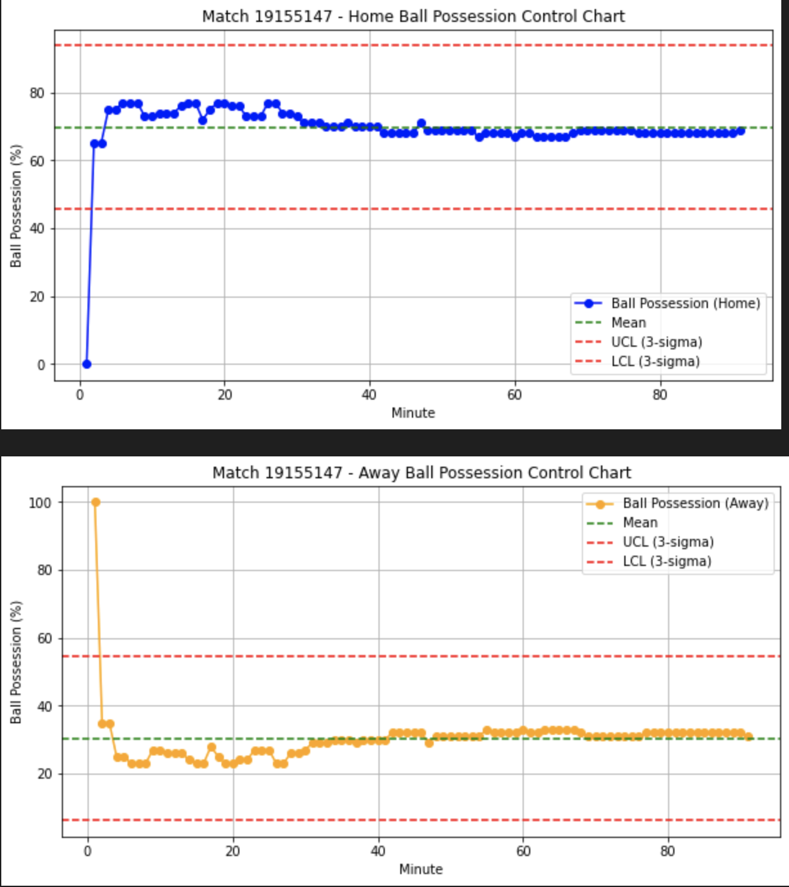

**ID19155147:**

Home and away team are Atalanta and Hellas Verona, respectively. 
•	Task (1): In the 15th minute of the match, the home team scored their third goal; the effect of the third goal is observed from the 25th minute onwards with a decrease in their ball possession. During the match, excluding the first 20 minutes, no red cards, yellow cards, or penalties are monitored. In the 29th minute, the 4th goal of the match is scored by the home team, whose effect is seen after 5 minutes in the 33rd minute by a slightly lower mean shift. In addition, the fifth goal of the home team, in the 35th minute, resulted in a significantly lower mean shift after 5 minutes. The home team begins with approximately 78% ball possession; then, it decreases to 70% at the end of the match. The away team’s ball possession increased from 25% to 32% throughout the game. Although the home team has a decreasing ball possession trend overall, they win the match. This is an exceptional result since the mean of the ball possession rate of the home team is nearly twice of the away team, with more than %70 ball possession rate.
 

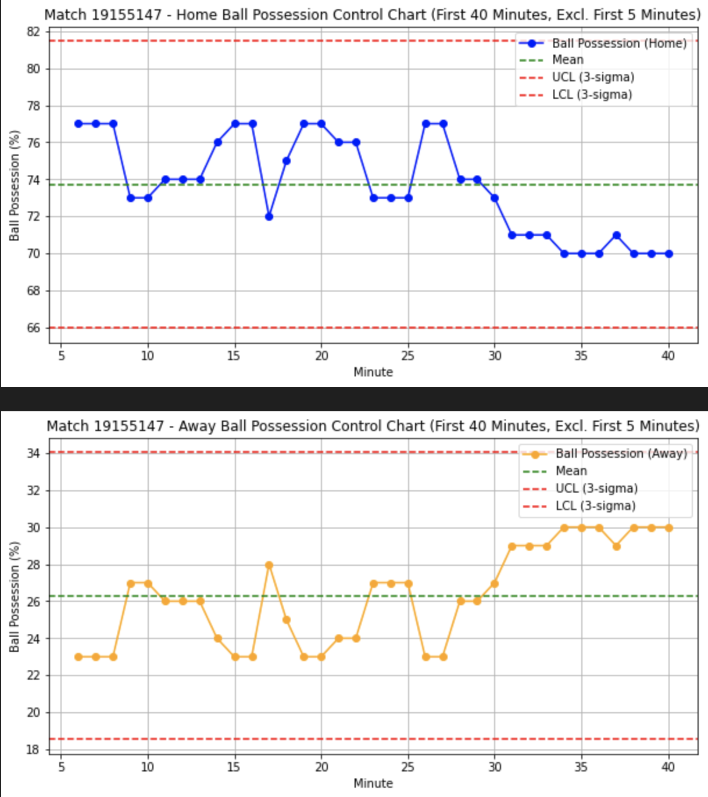
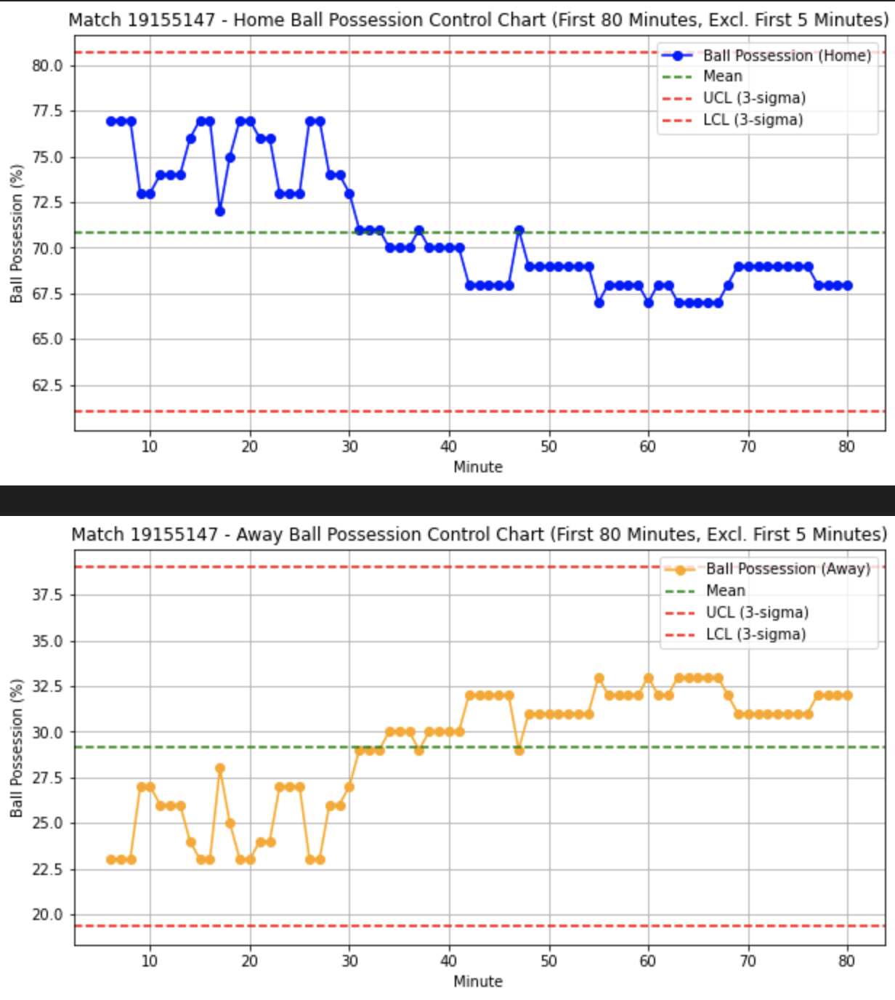

•	Task (2):  Starting from the 18th minute, there is a decreasing trend in ball possession of the home team. However, we don’t foresee a change in the end score of the match because the score in the 40th minute was 5-0.  In addition, even though we observed a decreasing ball possession trend, the gap between the ball possession of the home team and the away team's ball possession is massive.  Since the match score in the 40th minute is not ordinary, this match could be accepted as an outlier, and the overall decreasing trend of the home team can be neglected while testing our hypothesis. Lastly, another prediction made is that the yellow card received by the away team does not signal another event in the coming minutes of the match.

•	 After checking the first 80 minutes, the decreasing trend of the home team’s ball possession is maintained. These charts, therefore, contradict our assumption. As predicted, the yellow card does not trigger any other event.

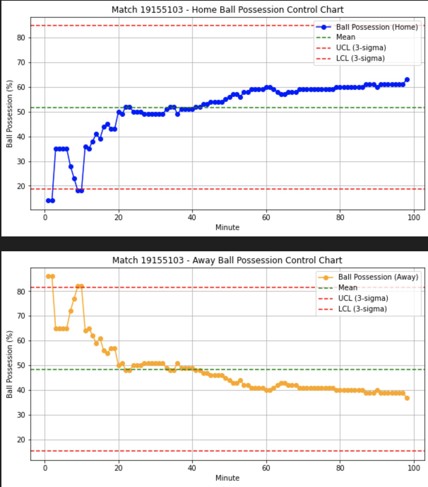

**ID19155103:**

Home and away team are Milan and Venezia, respectively. 
•	From the 35th minute onwards, an increasing trend of ball possession is observed. The reasons behind that trend are the excellent performance of the home team, with two penalties and four goals, and the away team's loss of motivation after receiving a yellow card. The home team wins the match with an increasing ball possession trend, which is aligned with the hypothesis stated before. As the ball possession rate of %63 shows, the home team dominated the match with a score of 4 – 0.

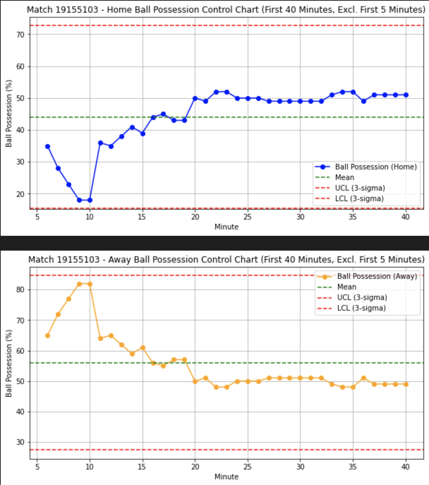
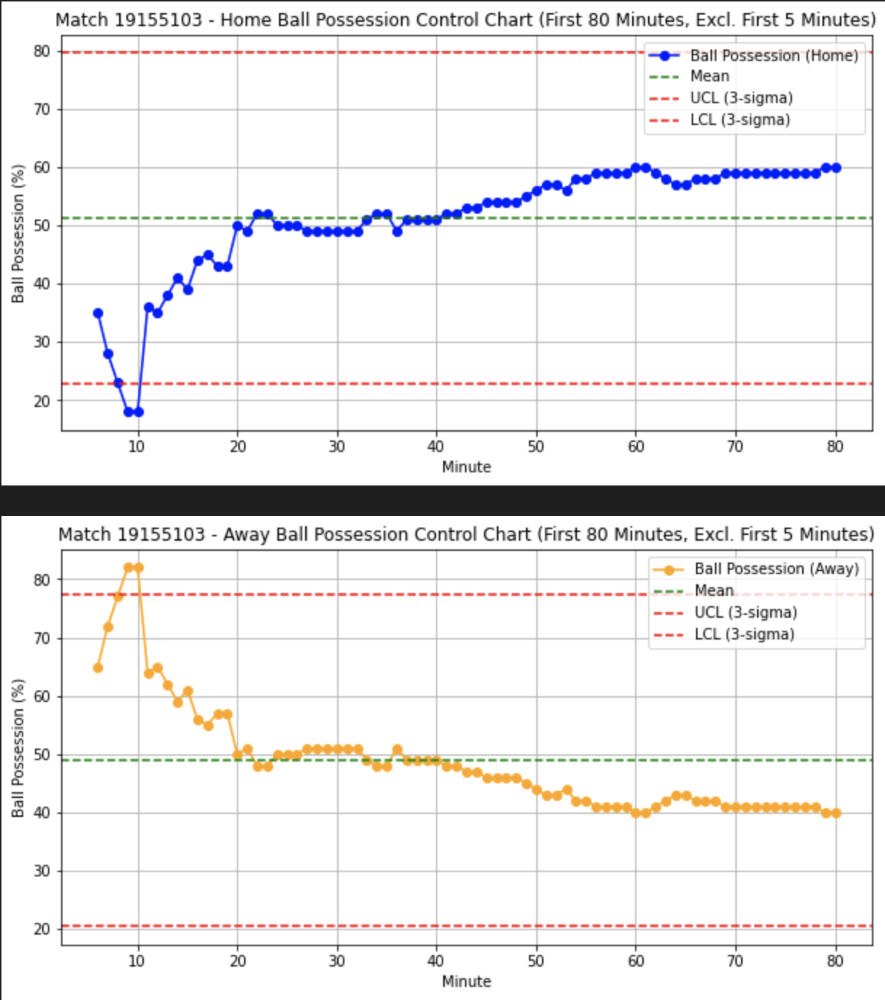

•	Task 2 : Although the ball possession rates in the first 40 minutes become stationary at around 50% for each team, we expect to see a decreasing trend in the ball possession rate of the away team due to the lack of motivation and the course of the events of the match, i.e., the number of penalties received and the goals of the home team.  The events that occurred in the first 40 minutes, such as goals, yellow cards, and penalties, show that the match is heating up. Therefore, a red card for the away team is awaited. 
•	In the 77th minute of the game, a red card is encountered, aligned with our prediction. In the 72nd and 73rd minutes, the second and third yellow cards are given to the away team, which reflects our guess for ambitious play. Overall, the home team won the match with the increasing trend of ball possessions. It is consistent with our hypothesis. 

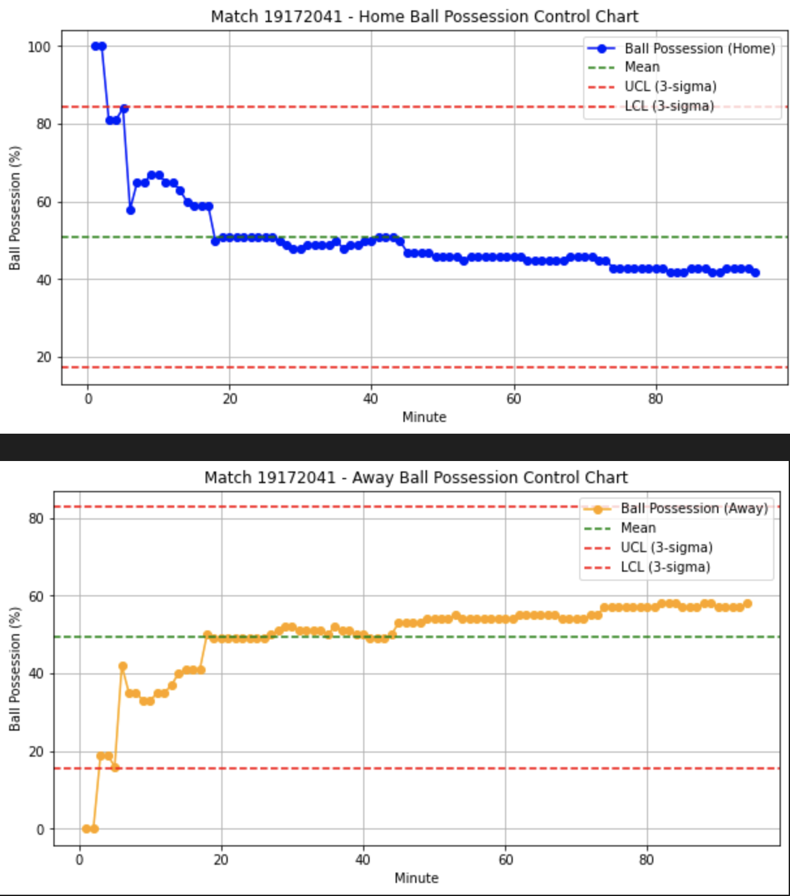

**ID19172041:**

Home and away team are Adana Demirspor and Galatasaray, respectively. 
•	Overall, the mean of ball possession of each team is similar. However, at the end of the match, cumulative ball possessions are 42% and 58% home and away, respectively. Away ball possession has an increasing ball possession rate, and away wins the match, which is compatible with the hypothesis stated. In the 30th minute, the away team scored their third goal, and the increase of the ball possession is captured on the control graph of the home team with a delay of 5 minutes. The reason for this is that the away team is playing in a relaxed manner. The 4th goal of the away team which is in the 37th minutes has an decreasing effect on the home team’s ball possession since the 45th minute. 

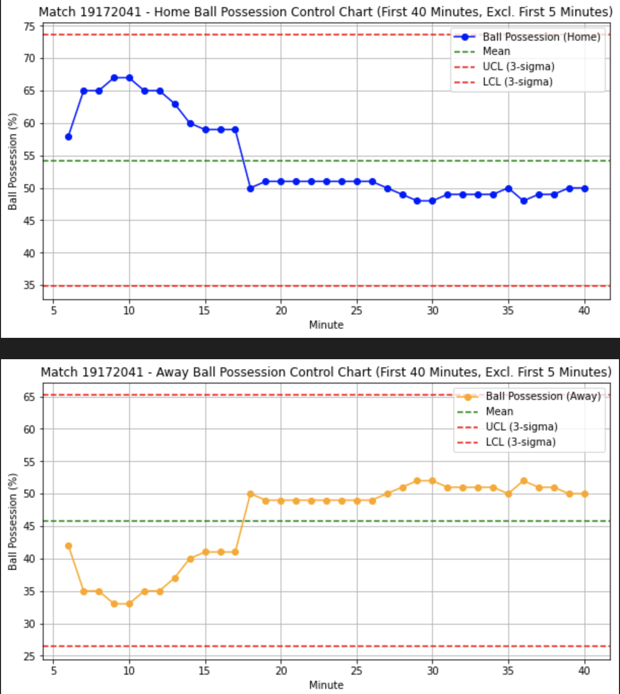
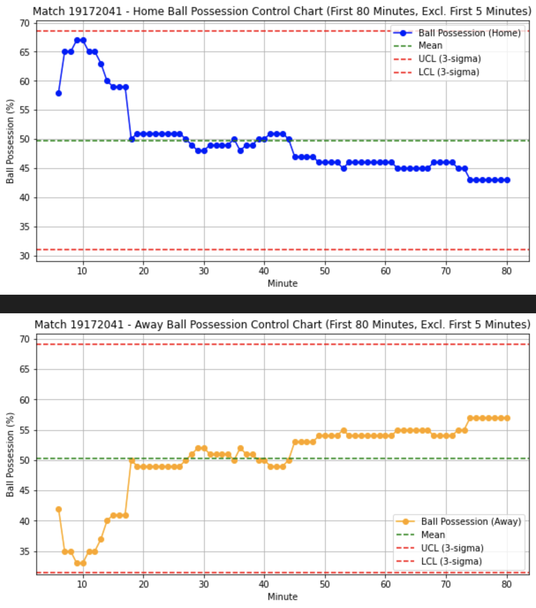

•	Task 2: (40 minutes chart) The shift in the mean of the away team’s ball possession could be used as an anticipation of the end result of the match, according to our hypothesis. Therefore, we expect to see a victory for the away team. Also, by checking the number of goals scored, the away team is four scores ahead of the home team. 2 yellow cards received by the home team in the first 40 minutes could lead to an interpretation of increasing competition. Although we do not expect this competition to cause a change in the end result, the number of yellow cards may increase in the coming minutes. In addition, the competition may also yield potential penalties and red cards.
•	(80 minutes) By checking the first 80 minutes, our predictions based on the first 40 minutes are consistent with the real data, with the increase in events such as yellow cards and penalties. The overall increasing trend of the away team’s ball possession justifies our hypothesis.

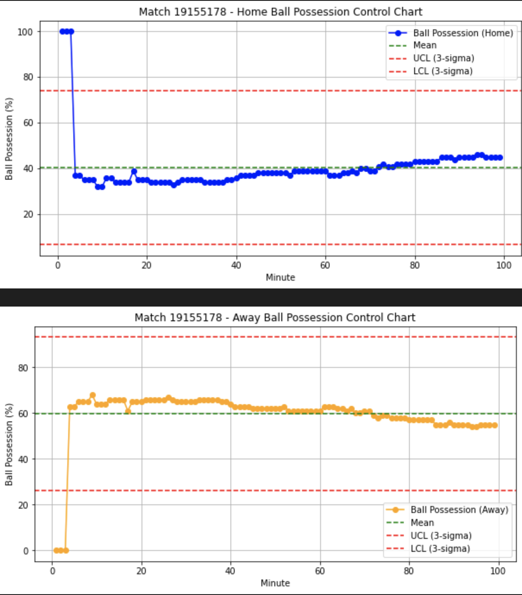

**ID 19155178:**

•	Task 1: Home team Cagliari observes an overall increasing trend in the ball possession rate. Although the match begins with the away team’s dominance, the competition throughout the game leads to a tied score of 3-3. The home team’s comeback, thanks to an increasing ball possession trend starting from 35% to 45%, also justifies our hypothesis.  

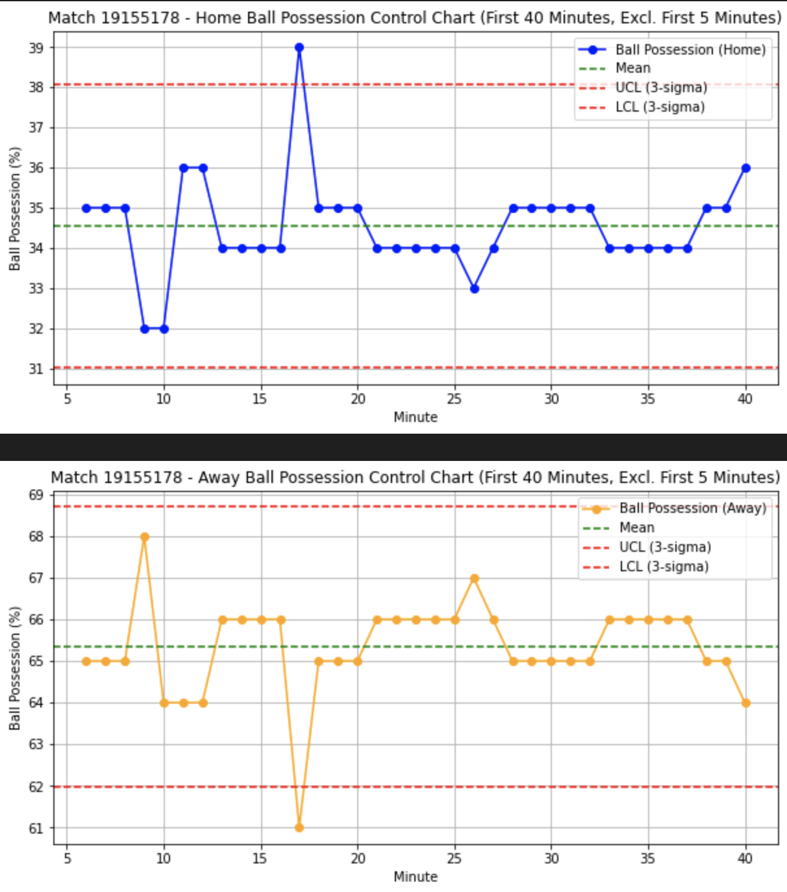
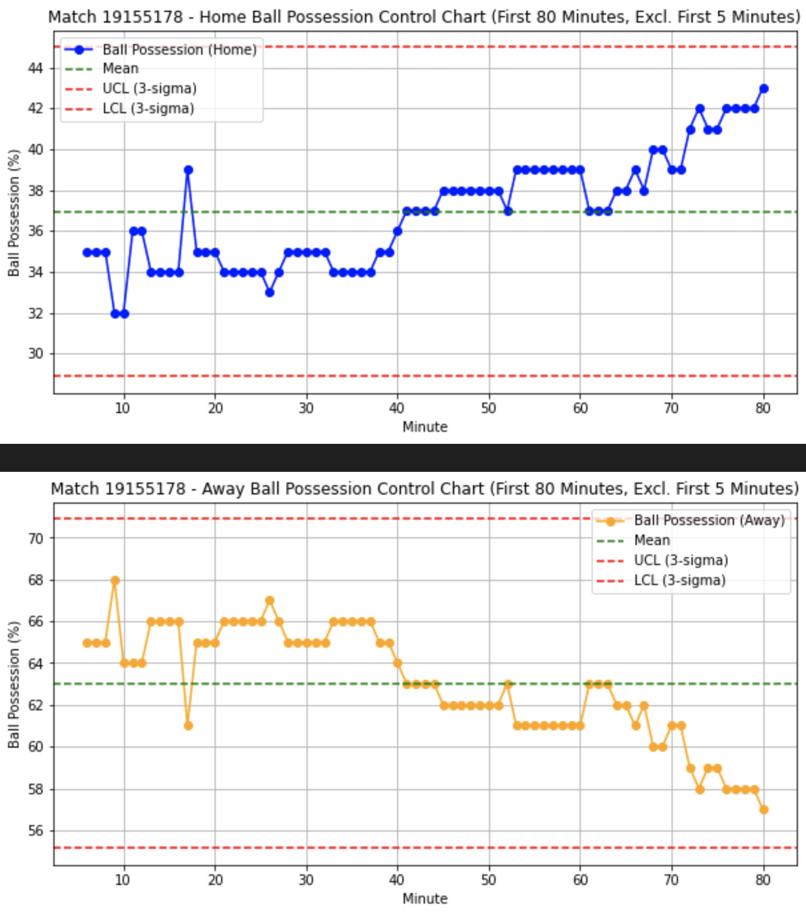
 

•	Task (2) : (40-minute chart): In the first 40 minutes, ball possession charts of home and away teams oscillate approximately around 35% and %65, respectively—this stationarity of the data results in generating narrower control bands. Therefore, the 17th minute of the match gives an out-of-control signal, which can be discarded from our analysis. On top of that, the lack of data points may increase the sensitivity and variance of the data points, the first 20 minutes are neglected in our analysis. Since the gap between the scores of each team is not high and no other events have been observed, we don’t expect to see a significant change in the events. 
•	By looking at the 40-minute chart, we couldn’t foresee the significant upward mean shift in the ball possession rate of the home team, starting from 34% and ending up at 38% approximately. Since we observed oscillating ball possessions around some mean values, we did not expect to see an increasing trend in the second half of the game. In addition, yellow cards in the second half of the match also were not expected.  

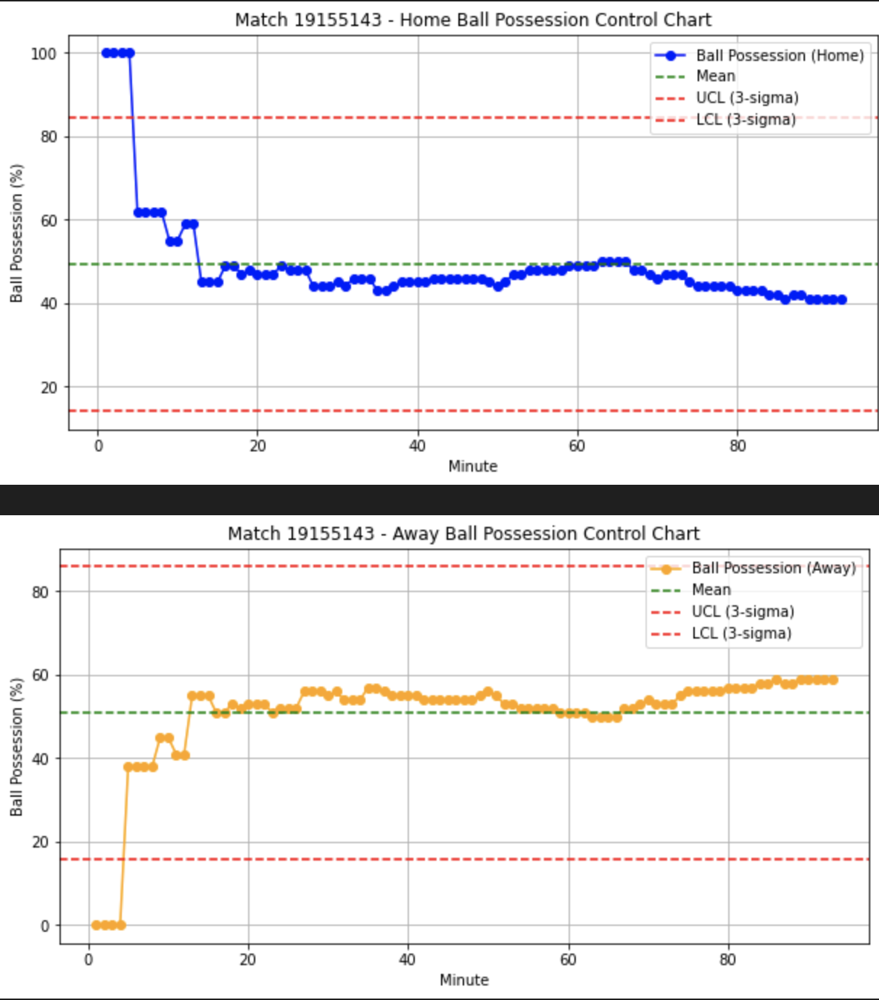

**ID 19155143:**

•	Task1: In the Lecce vs Florentina match, after the 3rd goal of the away team, Florentina, the home team’s ball possession rate begins to ascend 5 minutes delayed. The effect of the 4th goal in the 57th minute is observed in the 66th minute on Lecce’s ball possession chart. Furthermore, the descending trend of the home team’s ball possession percentages and the end score of the game supports the constructed hypothesis that the goal’s effect is reflected in the ball possession charts with some delay of around 5 to 10 minutes and the team with an overall increasing ball possession has a higher chance of winning the game. 

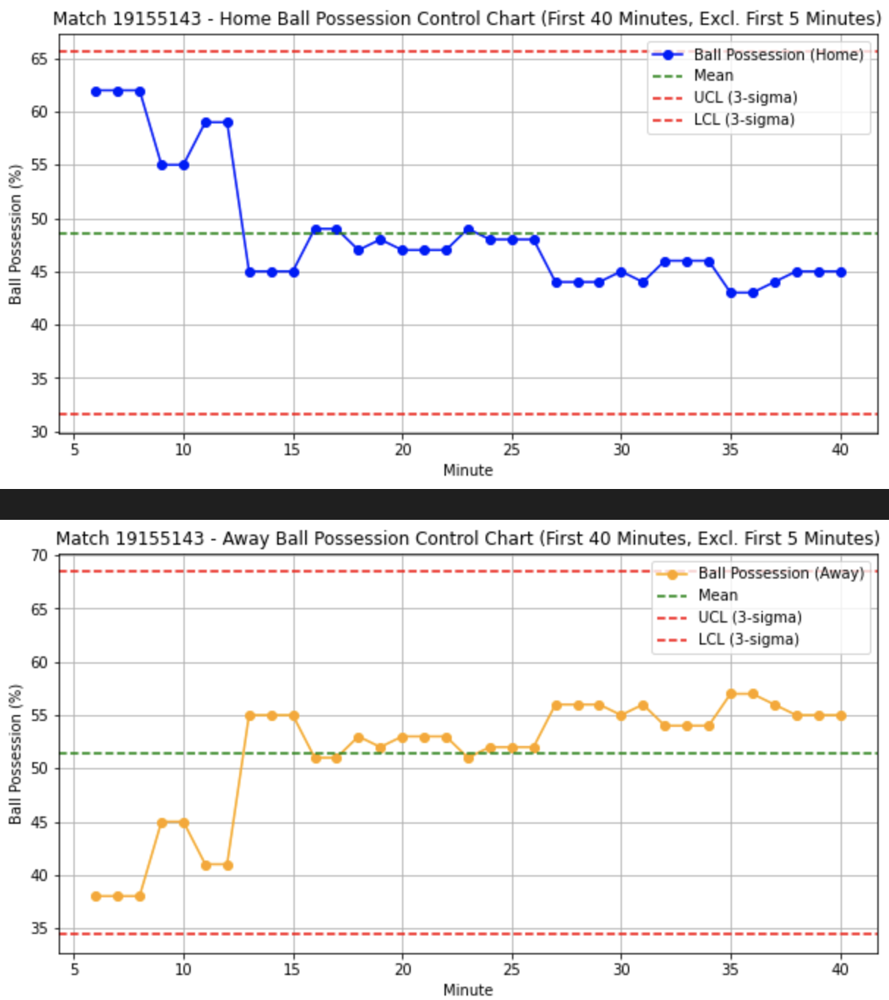
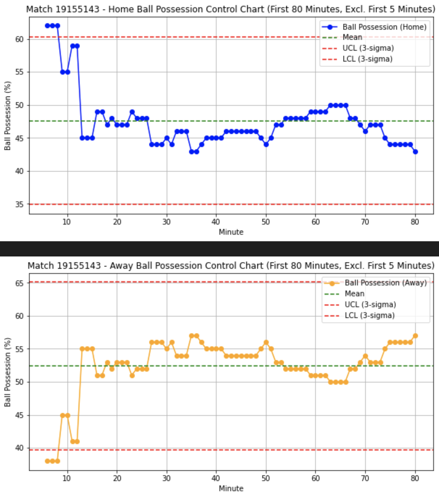
 

•	Task2: By only looking at the first 40 minutes, the first scenario for the game could be predicted as the away team’s victory since Florentina follows an increasing ball possession trend throughout the game. From another perspective, the game score may encourage the home team Lecce to play better and enhance their performance for a comeback. Our forecasts for the coming minutes, therefore, can be based on seeing an increase in the number of yellow cards and red cards assigned due to the competition in the game in the second proposed scenario. By checking the 80-minute chart, the number of yellow cards issued to Florentina rose to 3 and Lecce was issued with a red card, as expected based on our second prediction. Although there was an increase in Lecce’s ball possession rate at the beginning of the second period, this trend was followed by a decrease. 
 

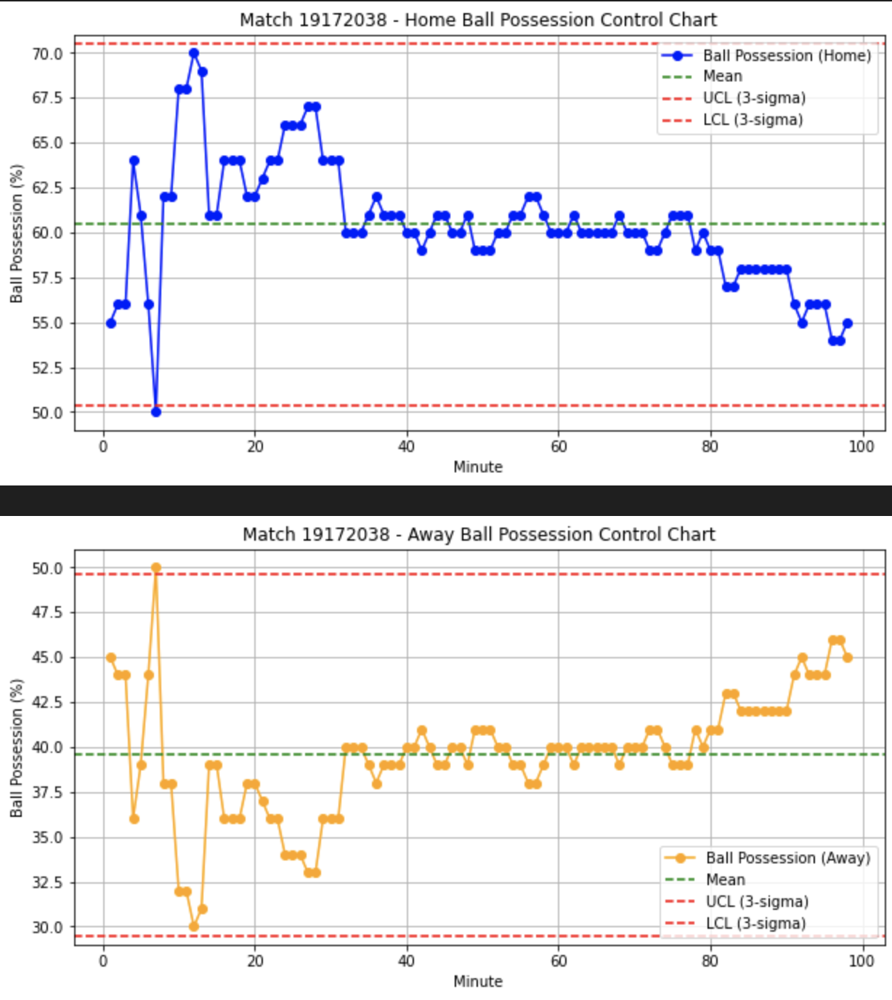

**ID 19172038:**
•	Task 1:  In the match between İstanbul Başakşehir and Antalyaspor, the home team's ball possession showed an early dominance, starting at 55% and reaching up to 64% within the first 10 minutes eventhough away team scored a goal. Despite conceding a goal to Antalyaspor in the 2nd minute, Başakşehir managed to maintain a steady possession rate throughout the first half and scored 2nd goal, indicating their control over the game’s tempo. However, as the match progressed into the later stages, a noticeable decline in their possession rate was observed, suggesting potential tactical adjustments or fatigue. Meanwhile, Antalyaspor's possession remained lower in the early stages, starting at 45% and decreasing further. Their initial goal disrupted Başakşehir momentarily but failed to translate into prolonged control or dominance over the ball. By the end of the match we visually observe mean shift toward home team.

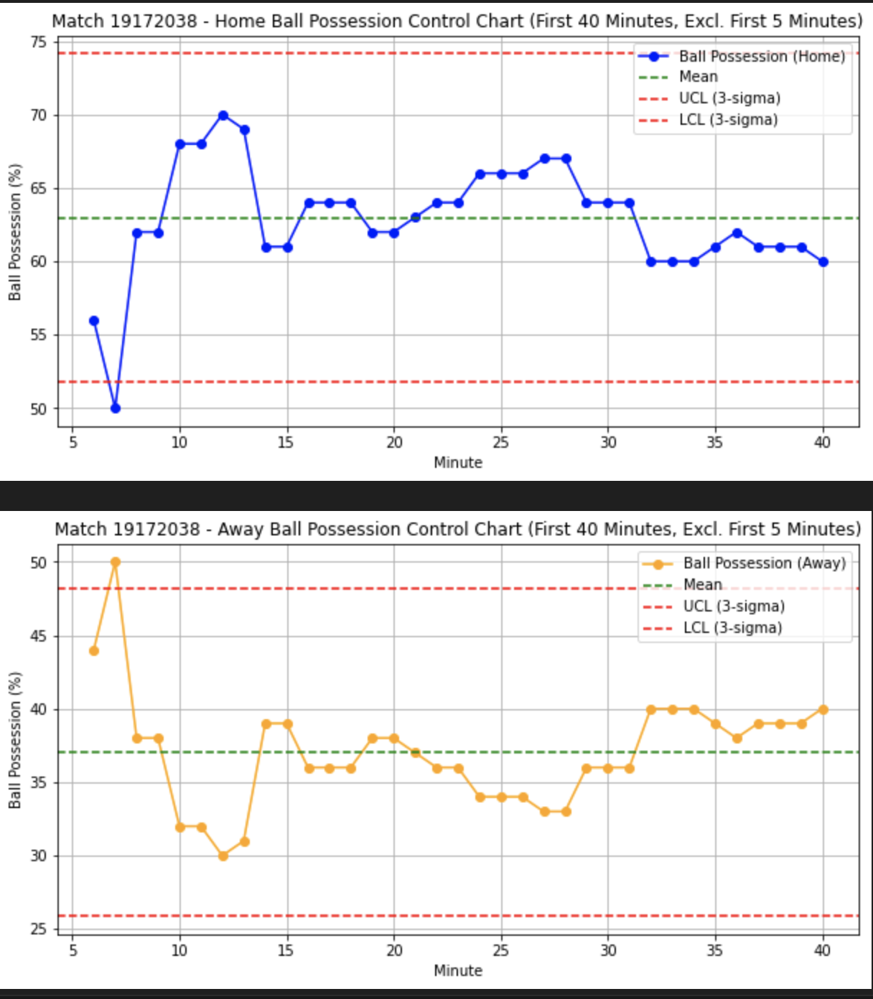
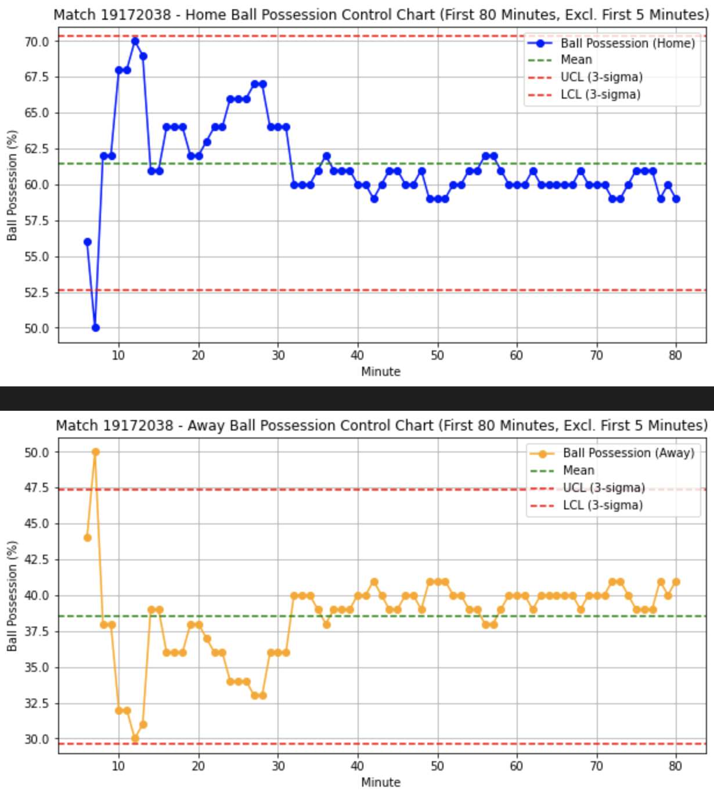

•	Task 2: Analyzing the first 40 minutes, Başakşehir's consistent possession of over 60% hinted at their strong start and control of the match dynamics. This trend aligned with their attempts to counter the early goal by Antalyaspor. However, by examining the first 80 minutes, a clear shift emerged as Başakşehir's possession started to decline, with Antalyaspor gradually increasing their ball possession, stabilizing above 40% in the final stages. Since no redcards or goal by penalty are observed This suggests that Antalyaspor adjusted their tactics effectively to neutralize Başakşehir's dominance, leading to a more competitive second half. The game events and possession trends indicate that while Başakşehir had the upper hand early on, Antalyaspor adapted and managed to close the gap in possession as the match neared its conclusion.

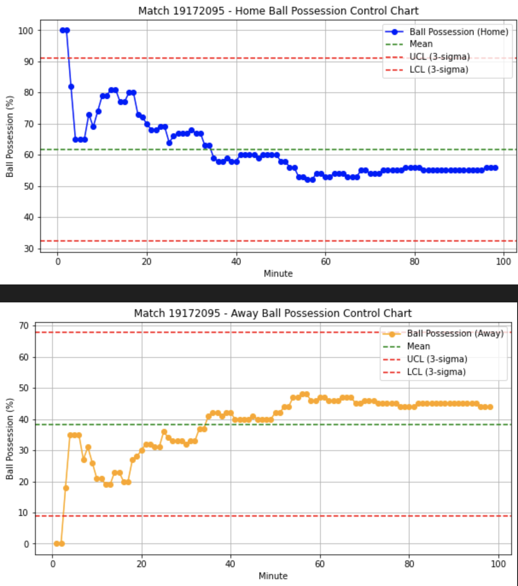

**ID 19172095:**

•	Task 1: In the Adana Demirspor vs Sivasspor match, an overall decreasing trend was observed in the home team’s ball possession rate. The effect of the away team’s goal in the 38th minute was observed on the home team’s ball possession chart as a decrease, starting from the 49th minute. The second goal scored by the home team in the 6th minute caused demoralization in the home team and ball possession decreased from that point on. The home team's attempt to increase their ball possession rate from the 60th minute onwards may be due to the heated match. The game ended with a 4-2 score with the victory of the away team, Sivasspor. As stated before, the team with an overall increasing ball possession trend won the match, which is another finding that supports our hypothesis.  

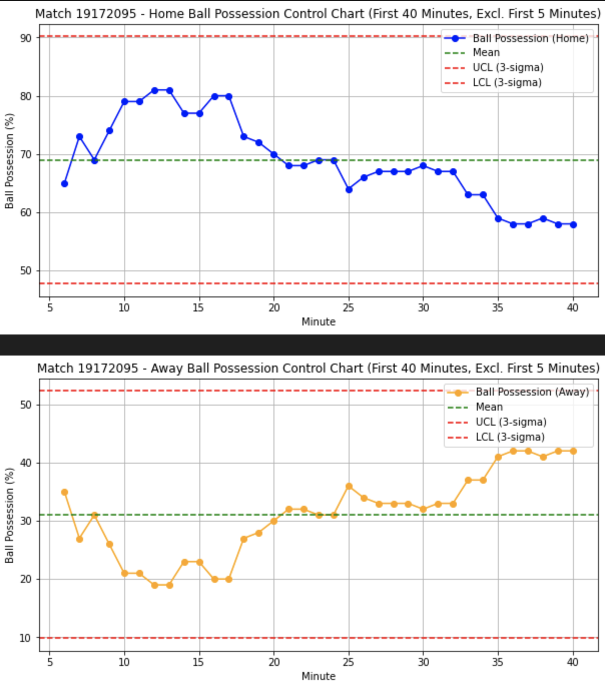
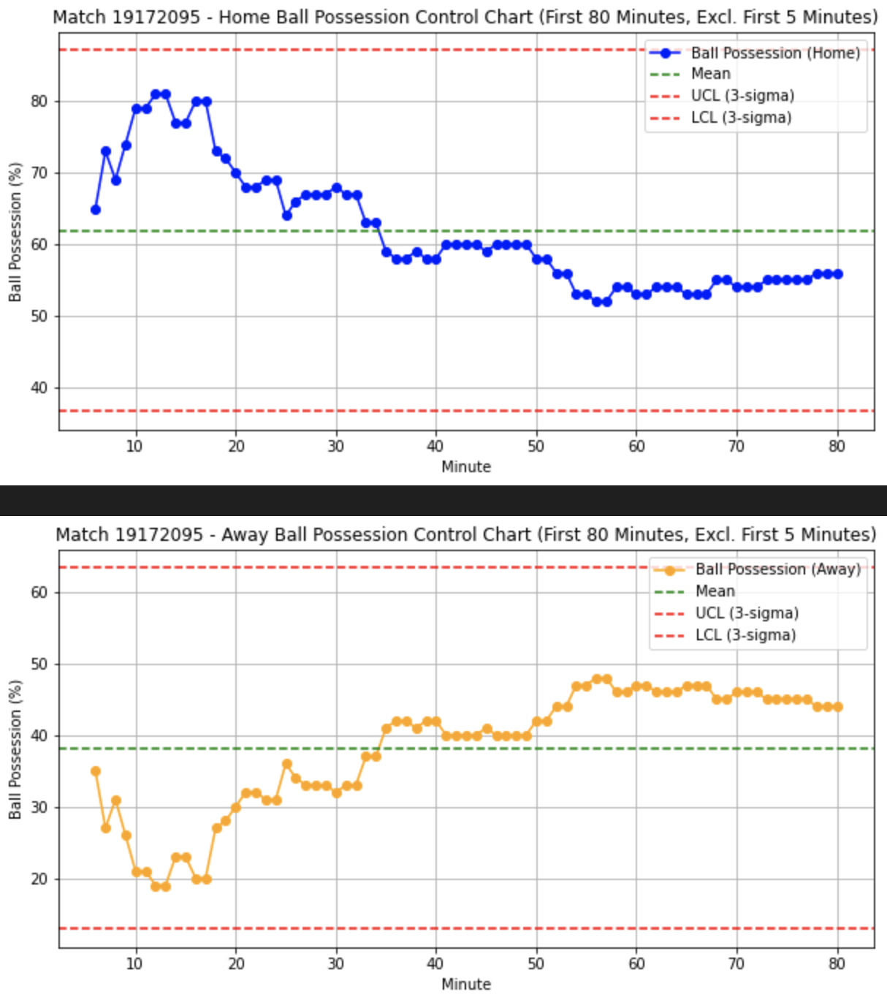

•	Task 2: In the 40-minute chart, the second goal of the home team, Adana Demirspor, in the 16th minute triggers the away team, Sivasspor, to increase their ball possession. Sivasspor’s obvious increasing ball possession trend may signal a potential comeback and a victory for the away team. In addition, the number of yellow cards issued for both teams at the end of the 40th minute could be an indicator of competition. In the 80-minute chart, there is a slight increase in the home team’s ball possession in the 55th minute despite the away team’s comeback and the match score at that time, which contradicts our predictions made by only looking at the 40-minute chart. However, the home team’s overall decreasing ball possession rate trend maintains the validity of our assumption. 

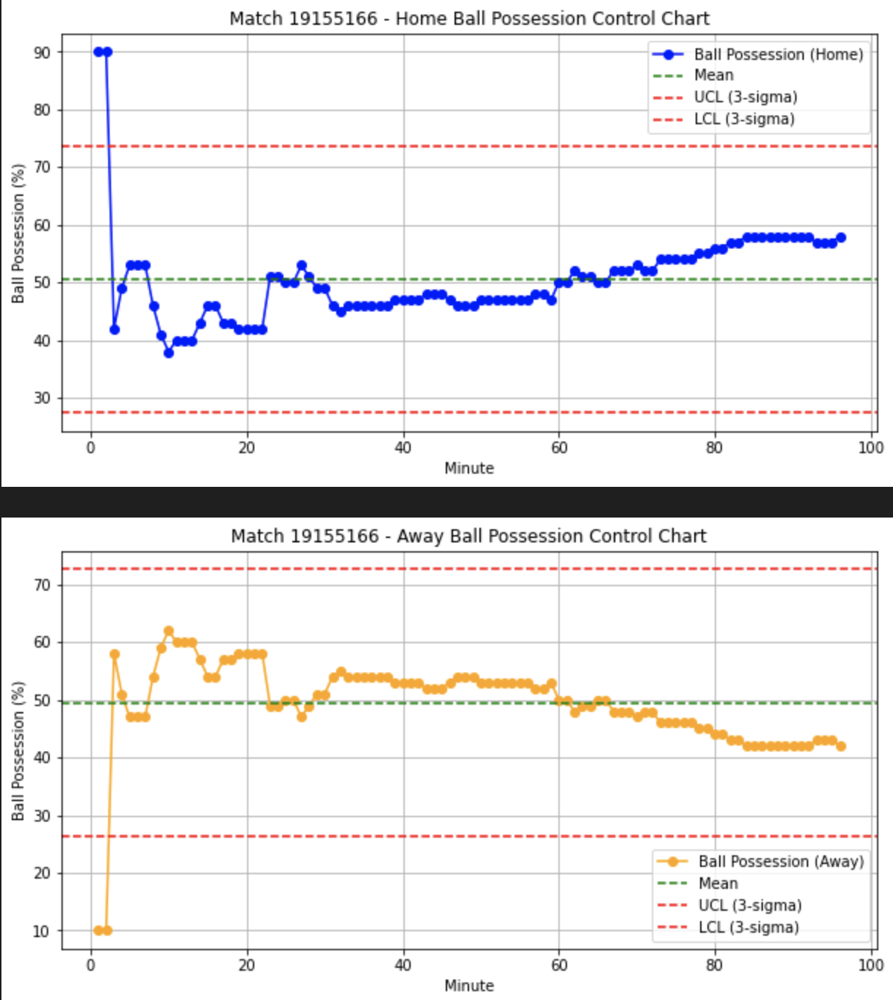

**ID 19155166:**

•	Task 1: In the match between Venezia and Udinese, the ball possession chart highlights significant fluctuations for both teams. Venezia (home team) began the match with an overwhelming 90% ball possession in the first two minutes, indicating an aggressive and dominant start. However, this dominance quickly diminished as Udinese (away team) improved their possession rate, reaching nearly equal possession around the 5th minute. Eventhough we observe fluctiation Udinese kept its dominance until minute 60 with scoring 2 goals. Here is a fact despite the ball possesion dominance of Udinese both teams have nearly equal attacks indicating that Venezia may play a counter-attack tactic.Venezia’s possession stabilized between 40%-50% during the mid/late-stage of the match, reflecting their struggle to regain control as Udinese managed to implement a more balanced approach. Penalty goal of Udinese gave them momentum and redcard to Udinese at 54th minute favored by Venezia's goal at minute 56. then we observe a trend on Xbar curve in Venezia's favor. Finally another penalty saves the day for Venezia.

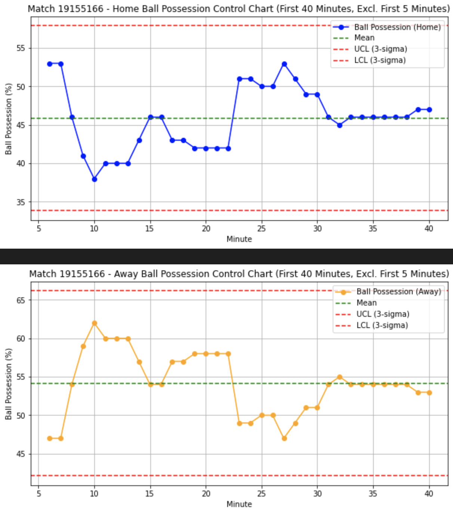
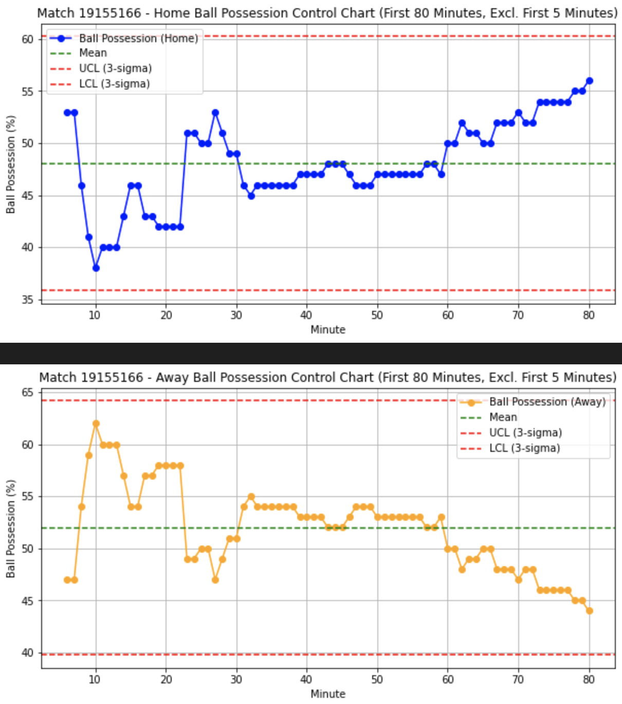

•	Task 2:
In the first 40 minutes, Udinese slightly dominated ball possession, maintaining a narrow advantage, though the attack counts for both teams were nearly identical. This balance in offensive effort indicated a competitive game, despite Udinese’s slight edge. However, the dynamics began to change when Udinese extended their lead to 2-0. Venezia responded immediately by earning a penalty in the 41st minute, converting it to make the score 2-1 just before halftime. This goal not only closed the gap but also marked the start of a shift in momentum toward Venezia.

In the second half, the match took a decisive turn when Udinese was reduced to 10 men with a red card in the 54th minute. Venezia quickly capitalized on their numerical advantage, scoring the equalizer just two minutes later in the 56th minute. From that point, ball possession trends shifted significantly in Venezia’s favor, reflecting their growing control over the game. Udinese’s defensive efforts intensified, but Venezia continued to dominate, eventually winning another penalty that sealed their comeback victory. This match highlights how critical events in the first half, such as penalties and red cards, can dramatically alter the course of the game, making it a strong example of using first-half dynamics to predict second-half trends and outcomes.

**CONCLUSION**

In our analysis we conducted by dividing the match into 40- and 80-minute intervals, the first 5 minutes of each match were neglected, and the potential causes of mean shifts due to the cumulative trait of ball possession ratio. By discarding the first 5 minutes, more reliable rates were obtained to begin our analysis. One of the starting points of our analysis was based on detecting whether a goal causes a mean shift. Shewhart charts were constructed for this task. Although Shewhart charts poorly perform in detecting small mean shifts, especially smaller than 1.5 sigma, observing the trends by also checking 40-minute and 80-minute ball possession charts gave insights about the trends and small shifts. According to the matches selected, the effect of a team's goal is usually reflected in their ball possession rate as an increase with a delay of 5 to 10 minutes. Our hypothesis was to check whether an overall increasing trend in ball possession ratio resulted in a victory. All the selected matches, except Atalanta and Hellas Verona, justify our hypothesis. Either a team with an increased trend makes a comeback and ties the score or wins the game.

**APPENDIX**

GenAI tool (OpenAI ChatGpt 4o model was used on debugging and error fixing prosedures of our project codes.)

**prompts:**

Generally error messages like eoncding and plotting errors were copied and pasted on chat and we asked to correct our code.
All interpretation and building & coding the algortihms tasks were made by individuals of our group.

